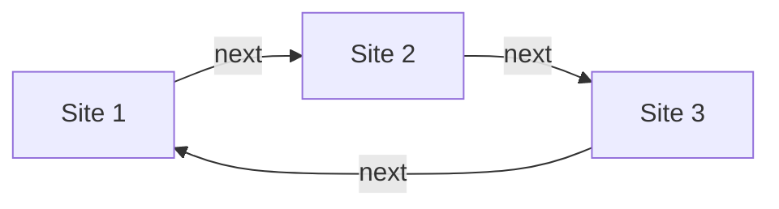

# 🐐 goated webring
A simple, SvelteKit 

## Installation

```
git clone https://github.com/AndrewDTR/goated-webring
cd goated-webring
cp .env.example .env
# Change the ADMIN_PASS variable
```

Then, based on how you want to deploy:

**Docker Compose**

```
docker compose up -d
```

**Node environments**

```
npm install
npm run build
node --env-file=.env build
```

## Usage

As an admin, you can access the settings by going to the `/admin` route and logging in using the password you set in your `.env`.

Here, you can change a few basic settings (see below), change the order of the sites in the ring, add sites manually, and create invites for members to add themselves.

The order of the sites determines their neighbors in the ring.



Members of the ring can link to their neighbors by using the base link, the routes `next` and `prev`, and the query param `site` with their own URLs.

That is, if a ring was being hosted on `https://ring.example.com/` and `https://person.one/` wanted to link to their neighbors, they would hyperlink `https://ring.example.com/prev?site=https://person.one` and `https://ring.example.com/next?site=https://person.one`.

If you don't want to type those out by hand, these links are available at `https://ring.example.com/links?site=https://person.one`

## Settings