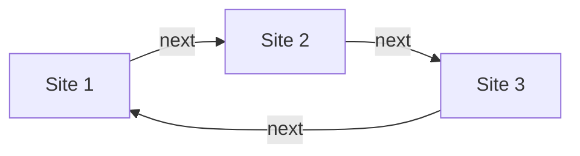

# 🐐 goated webring
this readme is TODO

## Installation

```
git clone https://github.com/AndrewDTR/goated-webring
cd goated-webring
cp .env.example .env
# Change the ADMIN_PASS variable
```

Then, based on how you want to deploy:

**Docker Compose**

```
docker compose up -d
```

**Node environments**

```
npm install
npm run build
node --env-file=.env build
```

## Usage

